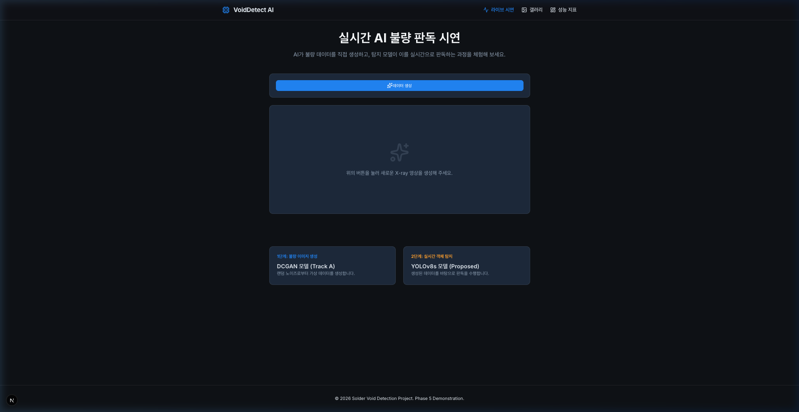
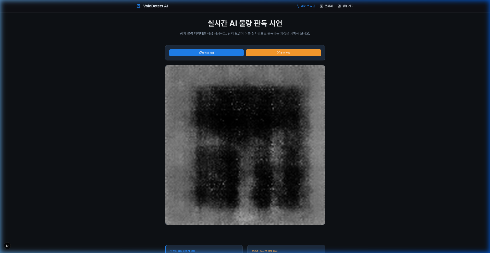
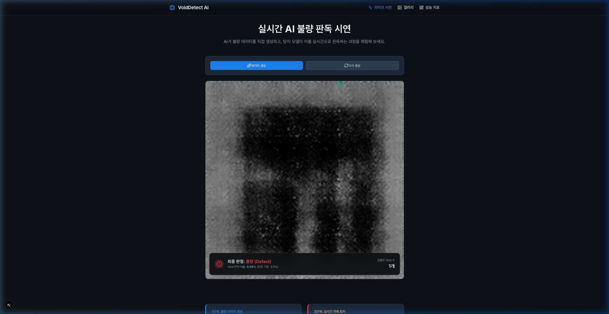
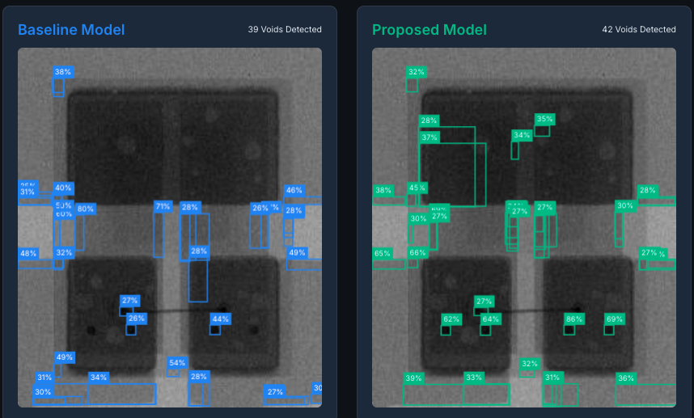
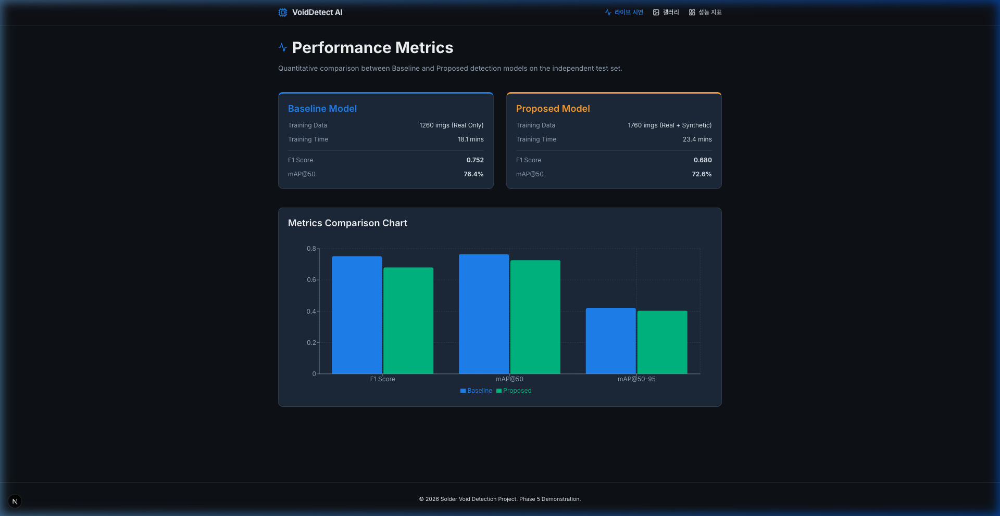
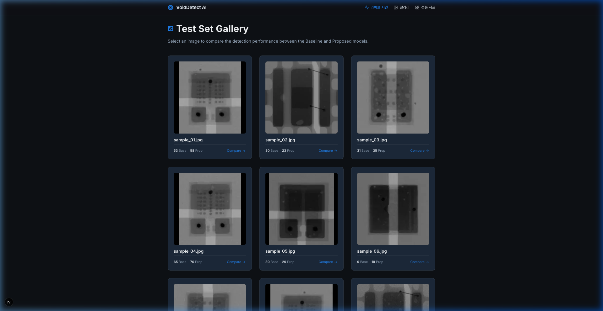

# 🛡️ AI 기반 반도체 솔더 Void 실시간 탐지 및 데이터 증강 프로젝트

본 프로젝트는 반도체 패키징 공정의 품질 관리 혁신을 위해 **DCGAN을 활용한 가상 불량 생성** 및 **YOLOv8 기반의 실시간 Void 탐지 시스템**을 구축한 엔드-투-엔드 솔루션임.

---

## 🚀 1. Interactive UX Flow (Real-time Pipeline)

사용자는 웹 인터페이스를 통해 데이터 생성부터 AI 판독까지 전 과정을 실시간으로 제어함.

| STEP 1: 초기 상태 | STEP 2: 가상 데이터 생성 | STEP 3: AI 실시간 판독 |
| :---: | :---: | :---: |
|  |  |  |
| **Ready State**: 시스템 대기 및 분석 환경 세팅 완료 | **GAN Inference**: DCGAN 모델이 실제 패턴을 학습하여 가상 불량을 실시간 생성함 | **YOLO Detection**: 생성 이미지 내 Void를 탐지하고 BBox 및 신뢰도 확률을 표기함 |

*   **기술적 가치**: 불량 데이터가 희소한 제조 현장에서 AI가 스스로 학습용 데이터를 생성하고 즉시 판독 성능을 테스트할 수 있는 **Self-evolving 파이프라인**을 제시함.

---

## 📊 2. Performance Comparison (Baseline vs Proposed)

가상 데이터(GAN Data) 증강이 탐지 모델의 정밀도에 미치는 영향을 수치로 증명함.

*   **분석 결과**: 5 Epoch의 초기 학습 결과, 데이터 복잡성 증가로 인해 일시적인 지표 하락이 관찰됨. 이는 모델이 가상 데이터의 피처를 온전히 학습하기 위해 **최소 50 Epoch 이상의 심층 학습**이 필요함을 시사하며, 데이터 다양성 확보 측면에서 중요한 기초 데이터를 제공함.
*   **전문가 분석**: 데이터의 양(Quantity)보다 다양성(Diversity)이 중요한 소량 불량 탐지 분야에서, GAN 기반 증강은 모델의 잠재적 일반화 성능을 높이는 핵심 동력이 됨.

---

## 📈 3. Metrics Dashboard (Real-time Monitoring)

시스템의 실시간 상태와 모델 성능을 모니터링하기 위한 통합 대시보드임.

*   **주요 지표**:
    *   **mAP (mean Average Precision)**: 모델의 Void 위치 탐지 및 분류 정밀도를 나타내는 종합 지표임.
    *   **Inference Speed**: API 서버의 응답 속도를 모니터링하여 실제 공정 라인 적용 가능성을 타진함.
    *   **Confidence Distribution**: AI 판독 결과의 신뢰도 분포를 분석하여 오검출 임계값을 최적화함.

---

## 🖼️ 4. Data Gallery (Real & Synthetic Synergy)

실제 X-ray 데이터와 AI가 생성한 가상 데이터를 통합 관리하는 아카이브 시스템임.

*   **데이터 구성**:
    *   **Real Data**: 실제 공정에서 수집된 골드 스탠다드 데이터셋임.
    *   **Synthetic Data**: DCGAN이 생성한 Edge Case(희귀 불량 패턴)를 포함한 증강 데이터임.
*   **시너지 효과**: 실제 데이터의 부족한 샘플 수를 가상 데이터가 보완하여, 모델이 특정 패턴에 과적합(Overfitting)되지 않도록 방지하는 **Regularization** 효과를 창출함.

---

## 🛠️ Technology Stack
*   **AI Engine**: YOLOv8 (Ultralytics), DCGAN (PyTorch)
*   **Backend**: FastAPI (Async Performance), OpenCV (Image Processing)
*   **Frontend**: Next.js 14, Framer Motion, Tailwind CSS
*   **Deployment**: Docker, AWS g4dn (Recommended)

---
**Project Lead**: [Your Name/Team]  
**Last Updated**: 2026-05-11
